# PeopleApp

## Setup
### Project
- Voeg een nieuwe ASP.NET Core Web API applicatie toe aan de bestaande solution met de naam PeopleApp.Api.

| Template    | Configure   | Additional info |
| ----------- | ----------- | --------------- |
|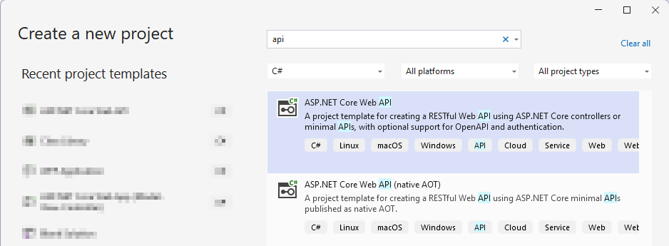|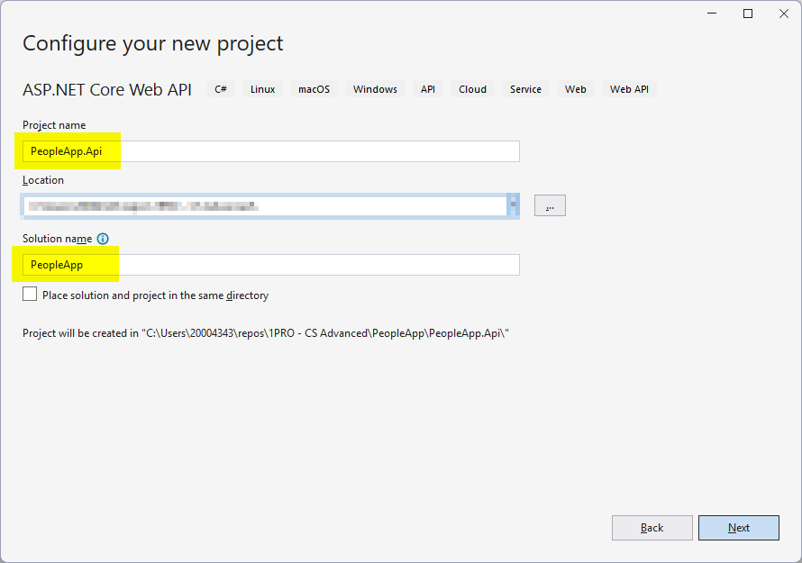|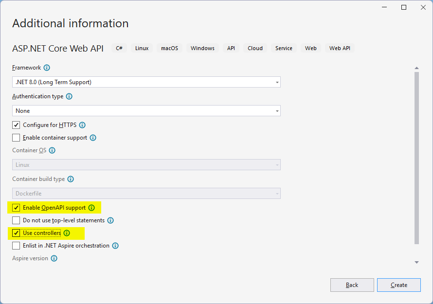|

### Folders & bestanden
- Verwijder de bestaande WeatherForecastController.cs en WeatherForecast.cs bestanden
- Zorg voor de volgende folder-structuur en bestanden:
    ```
    PeopleApp.Api
    │- Controllers (empty)
    │- Data
        │- AppDbContext.cs    
    │- Entities
        │- Department.cs   
        │- Location.cs
        │- Person.cs
    ```

### Packages
- Installeer onderstaande NuGet packages:
    -   ```
        Microsoft.EntityFrameworkCore.SqlServer
        ``` 
    -   ```
        Microsoft.EntityFrameworkCore.Tools
        ```
> [!CAUTION]
> Let op dat je de juiste versie selecteert!

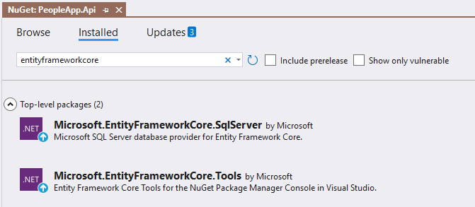

### DbContext
- Vervolledig de AppDbContext klasse in de Data folder en registreer deze in de DI container van de applicatie. Gebruik hiervoor de PeopleConnection uit het appsettings.json bestand.
    ```csharp
    public class AppDbContext : DbContext
    {
        public AppDbContext(DbContextOptions<AppDbContext> options) : base(options) { }

        public DbSet<Department> Departments { get; set; }
        public DbSet<Location> Locations { get; set; }
        public DbSet<Person> People { get; set; }
    }
    ```
	```csharp
    var connectionString = builder.Configuration.GetConnectionString("PeopleConnection");
    builder.Services.AddDbContext<AppDbContext>(options =>
    {
        options.UseSqlServer(connectionString);    
    });
    ```

### Entities
- Vervolledig de entity classes
    ```csharp title="Department.cs"
    public class Department
    {
        public long Id { get; set; }
        public string Name { get; set; }
        public IEnumerable<Person> People { get; set; }
    }
    ```
    ```csharp title="Location.cs"
    public class Location
    {
        public long Id { get; set; }
        public string City { get; set; }
        public string State { get; set; }
        public IEnumerable<Person>? People { get; set; }
    }
    ```
    ```cs title="Person.cs"
    public class Person
    {
        public long Id { get; set; }
        public string Firstname { get; set; }
        public string Surname { get; set; }
        public Department Department { get; set; }
        public long DepartmentId { get; set; }
        public Location Location { get; set; }
        public long LocationId { get; set; }
    }
    ```
### Migrations
- Voer de volgende commando's uit in de Package Manager Console:
    ```
    Add-Migration Initial
    Update-Database
    ```

### Seed Data
- Maak een nieuw class aan in de Data folder met de naam ```DbInitializer```:
    ```
    public static class DbInitializer
    {
        public static void SeedData(this WebApplication app)
        {
            using (var scope = app.Services.CreateScope())
            {
                AppDbContext context = scope.ServiceProvider.GetRequiredService<AppDbContext>();
                context.SeedPeopleData();
            }
        }

        private static void SeedPeopleData(this AppDbContext context)
        {
            context.Database.Migrate();
            if (!context.People.Any() && !context.Departments.Any() && !context.Locations.Any())
            {

                Department d1 = new Department { Name = "Sales" };
                Department d2 = new Department { Name = "Development" };
                Department d3 = new Department { Name = "Support" };
                Department d4 = new Department { Name = "Facilities" };

                context.Departments.AddRange(d1, d2, d3, d4);
                context.SaveChanges();

                Location l1 = new Location { City = "Oakland", State = "CA" };
                Location l2 = new Location { City = "San Jose", State = "CA" };
                Location l3 = new Location { City = "New York", State = "NY" };
                context.Locations.AddRange(l1, l2, l3);

                context.People.AddRange(
                    new Person
                    {
                        Firstname = "Francesca",
                        Surname = "Jacobs",
                        Department = d2,
                        Location = l1
                    },
                    new Person
                    {
                        Firstname = "Charles",
                        Surname = "Fuentes",
                        Department = d2,
                        Location = l3
                    },
                    new Person
                    {
                        Firstname = "Bright",
                        Surname = "Becker",
                        Department = d4,
                        Location = l1
                    },
                    new Person
                    {
                        Firstname = "Murphy",
                        Surname = "Lara",
                        Department = d1,
                        Location = l3
                    },
                    new Person
                    {
                        Firstname = "Beasley",
                        Surname = "Hoffman",
                        Department = d4,
                        Location = l3
                    },
                    new Person
                    {
                        Firstname = "Marks",
                        Surname = "Hays",
                        Department = d4,
                        Location = l1
                    },
                    new Person
                    {
                        Firstname = "Underwood",
                        Surname = "Trujillo",
                        Department = d2,
                        Location = l1
                    },
                    new Person
                    {
                        Firstname = "Randall",
                        Surname = "Lloyd",
                        Department = d3,
                        Location = l2
                    },
                    new Person
                    {
                        Firstname = "Guzman",
                        Surname = "Case",
                        Department = d2,
                        Location = l2
                    });
                context.SaveChanges();
            }
        }
    }
    ```
- Zorg nu dat deze methode wordt aangeroepen in de ```Program``` class net voor de applicatie wordt gestart:
    ```csharp
    app.SeedData();
    app.Run();
    ```
### Run!
De applicatie kan nu gestart worden zonder fouten **MAAR** de API heeft nog geen functionaliteit.

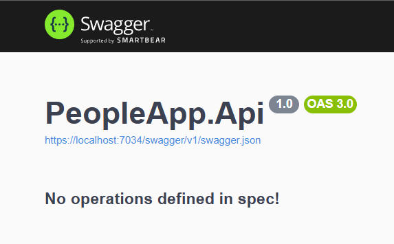

## LocationController
- Voeg een folder ```Api```toe aan de Controllers folder
- Voeg aan deze folder een nieuwe controller toe met de naam ```LocationController```
    
    | Add | Scaffold   | Name |      
    | --- | ---------- | ---- |
    | 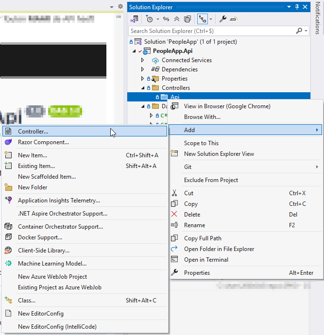 | 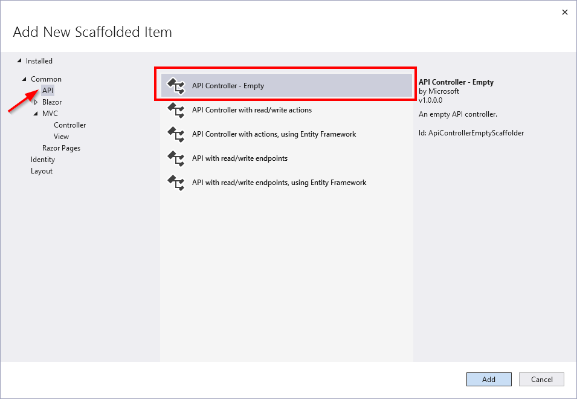 | 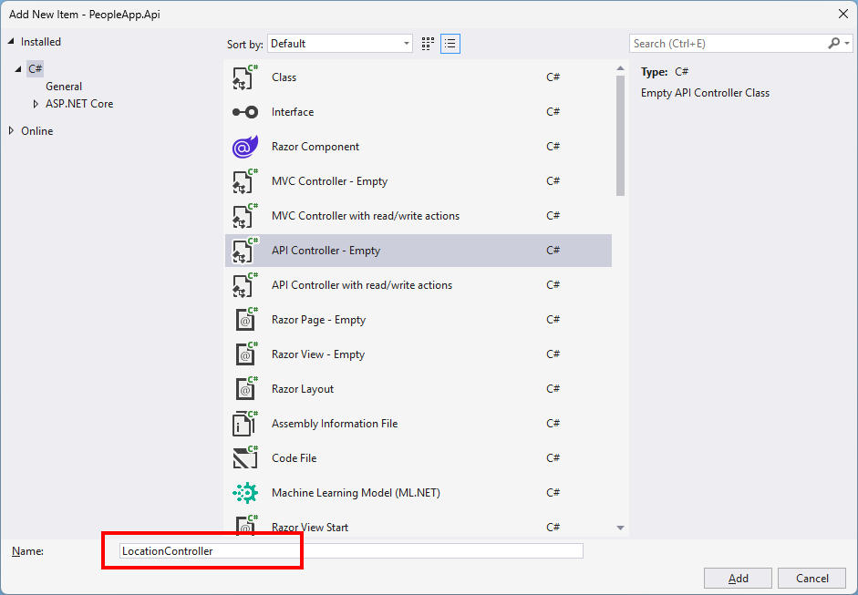 |

> [!TIP]
> Dankzij het ```[Route("api/[controller]")]``` attribuut en de extra endpoint configuratie in Program.cs zullen alle HTTP requests van ```/api/location``` naar deze controller worden geleid. 

### Dependency Injection
- Voeg de ```AppDbContext``` toe aan de constructor van de ```LocationController``` en wijs deze toe aan een readonly instance variabele.
    ```cs
    private readonly AppDbContext _context;

    public LocationController(AppDbContext context)
    {
        _context = context;
    }
    ```
### Request
Elke HTTP request heeft een URl en een *verb* (= methode).
- De URL bepaalt over welke data het gaat (bv. /api/location)
- De verb bepaalt welke operatie er moet worden uitgevoerd: 
    - GET: haal 1 of meer data object op
    - POST: voeg een data object toe
    - PUT: pas een bestaand data object aan
    - DELETE: verwijder een bestaand data object

## GetLocations
- Maak een GET methode aan in de ```LocationController``` die alle locaties ophaalt uit de database en teruggeeft als JSON object:
```csharp
[HttpGet]
public async Task<ActionResult<IEnumerable<Location>>> GetLocations()
{
    try
    {
        var locations = await _context.Locations.ToListAsync();
        return Ok(locations);
    }
    catch (Exception)
    {
        return BadRequest();
    }
}
```
> [!NOTE]  
> Deze functie geeft een ```ActionResult``` terug. Dit [geniet de voorkeur](https://learn.microsoft.com/en-us/aspnet/core/web-api/action-return-types?view=aspnetcore-8.0#actionresult-vs-iactionresult) ten opzicht van een ```IActionResult``` wanneer het type van het resultaat vast staat.
> In dit voorbeeld is het type altijd een ```IEnumerable<Location>``` en is een ```ActionResult``` dus de beste keuze.

> [!NOTE]  
> Omdat een API steeds beschikbaar moet zijn voor inkomende request te behandelen zorgen we er voor dat de functies steeds asynchroon worden uitgevoerd!

### Run!
Start de applicatie nogmaals en bekijk het resultaat!


### JSON
De data die wordt geretourneerd in een RESTful web service heeft het JSON-formaat (JavaScript Object Notation):
- Object aangeduid door ```{}```
- Lijst (reeks) aangeduid door ```[]```
- Eigenschappen aangeduid door ```"key": "value"```

```json
[
  {
    "id": 1,
    "city": "Oakland",
    "state": "CA",
    "people": null
  },
  {
    "id": 2,
    "city": "San Jose",
    "state": "CA",
    "people": null
  },
  {
    "id": 3,
    "city": "New York",
    "state": "NY",
    "people": null
  }
]
```

## Postman
Een API kan (beperkt) getest worden met Swagger maar om uitgebreide testen te kunnen doen maken we beter gebruik van een andere tool om HTTP requests op te stellen.

> [!NOTE]
> Een GET request kan zelfs eenvoudig getest worden met de browser. Start je applicatie opnieuw en surf naar [https://localhost:7034/api/Location](https://localhost:7034/api/Location) om het resultaat te bekijken.

### Download
Maak een account op [https://www.postman.com](https://www.postman.com) en installeer de desktop agent via [https://www.postman.com/downloads](https://www.postman.com/downloads)

### Collections & request
- Maak een nieuwe collection aan ```PeopleApp``` en voeg een request toe ```GetLocations```

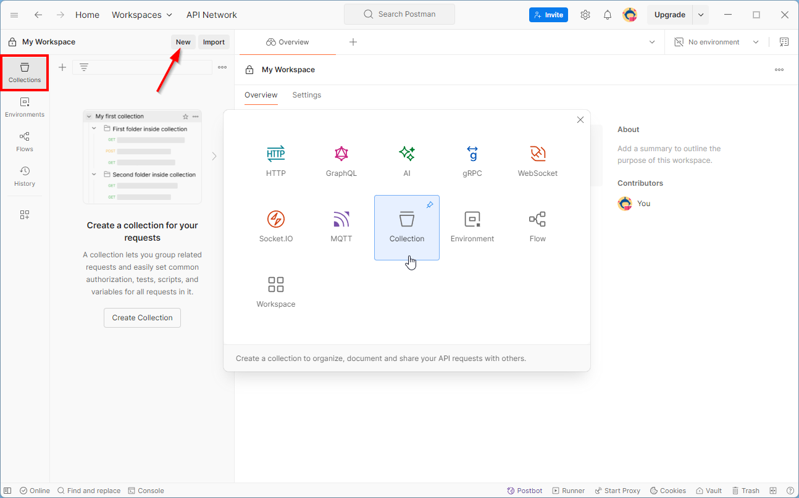
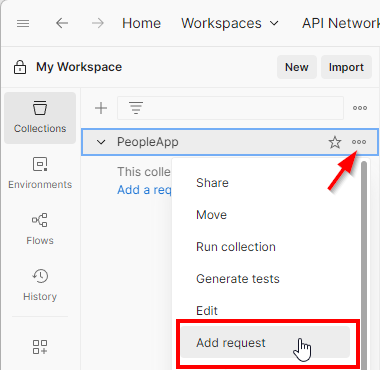
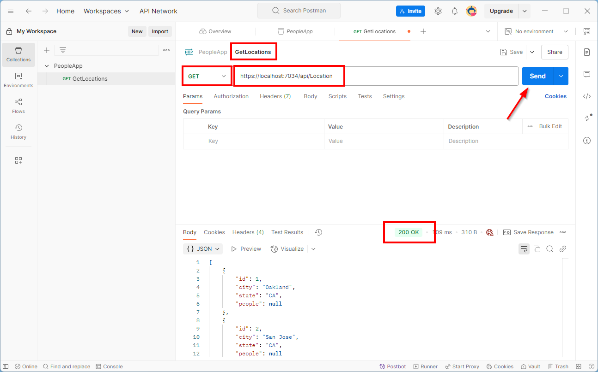

## GetDetails
- Voeg een ```GetDetails``` action toe aan de LocationController

```cs
[HttpGet("{id}")]
public async Task<ActionResult<Location>> GetDetails(long id)
{
    Location? location = await _context.Locations.FindAsync(id);
    if (location == null)
    {
        return NotFound();
    }
    return Ok(location);
}
```

> [!TIP]
> Het [HttpGet] attribuut (in combinatie met het [Route] attribuut van de controller) zorgt ervoor dat een HTTP GET request naar bv. ```/api/location/1``` naar deze action worden geleid. 
> - Als de locatie niet gevonden wordt geven we het resultaat van de NotFound methode terug. Dit gaat zorgen voor een 404 code in de response.
> - De Ok methode zorgt ervoor dat de HTTP response een 200 code gaat hebben en in de body een JSON-representatie van het model zal bevatten.

### Run!
- Test de nieuwe action in je browser en met Swagger
- Maak ten slotte een nieuw request aan in de PeopleApp-collection van Postman

#### Swagger
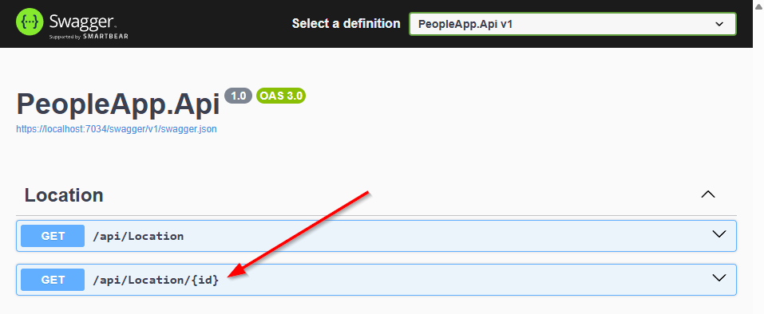

#### Postman
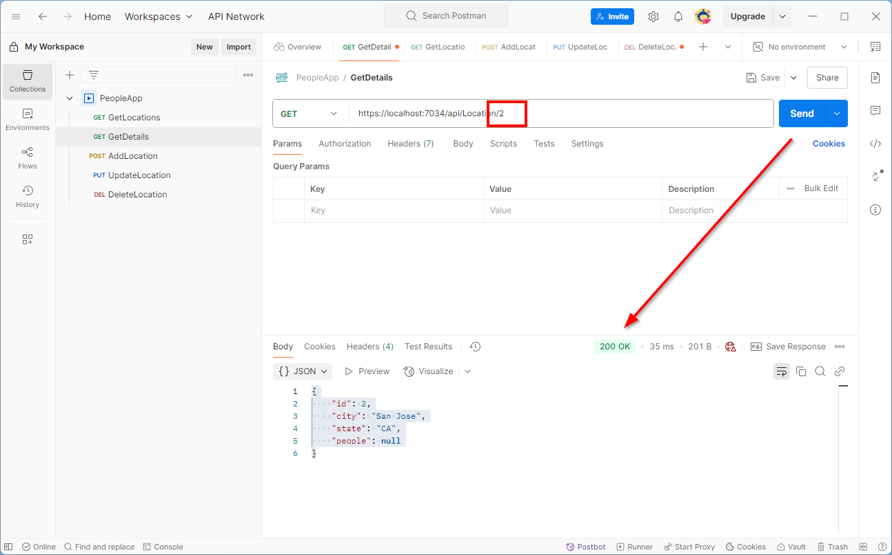
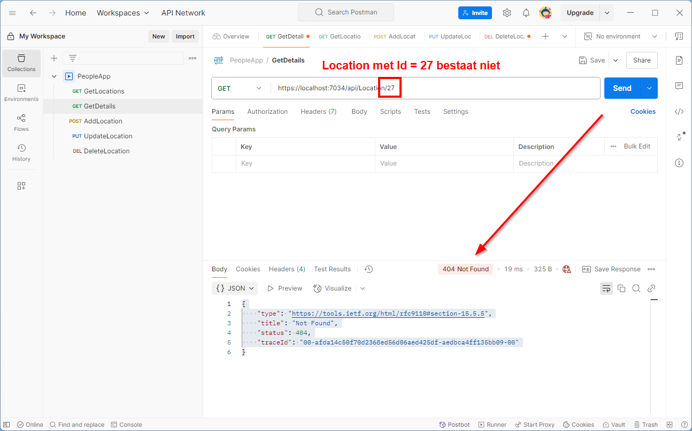

## AddLocation
### Model
> [!IMPORTANT]  
> Omdat we onze entities niet altijd willen blootstellen aan de buitenwereld kunnen we ook gebruik maken van specifieke request en response modellen.

- Maak een nieuwe folder ```Models``` aan in de root van de applicatie
- Voeg een nieuwe class ```CreateLocationRequest``` toe aan deze folder
    ```csharp
    public class CreateLocationRequest
    {
        public string City { get; set; }
        public string State { get; set; }
    }
    ```
### Action
- Maak een nieuwe action aan in de LocationController die een nieuwe locatie toevoegt aan de database
    ```cs
    [HttpPost]
    public async Task<ActionResult<Location>> AddLocation(CreateLocationRequest request)
    {
        try
        {
            Location location = new Location
            {
                City = request.City,
                State = request.State
            };
            await _context.Locations.AddAsync(location);
            await _context.SaveChangesAsync();
                
            return Ok(location);
        }
        catch (Exception)
        {
            return BadRequest();
        }
    }
    ```
> [!TIP]
>   - Het [HttpPost] attribuut (in combinatie met het [Route] attribuut van de controller) zorgt ervoor een HTTP POST request naar “/api/location” naar deze action worden geleid. 
>   - Het parameter model wordt opgevuld met gegevens die MVC in de request body (json) vindt.
>   - De Ok methode zorgt ervoor dat de HTTP response een 200 code gaat terug geven en in de body een JSON-representatie van het output model zal bevatten.

### Run!
#### Swagger
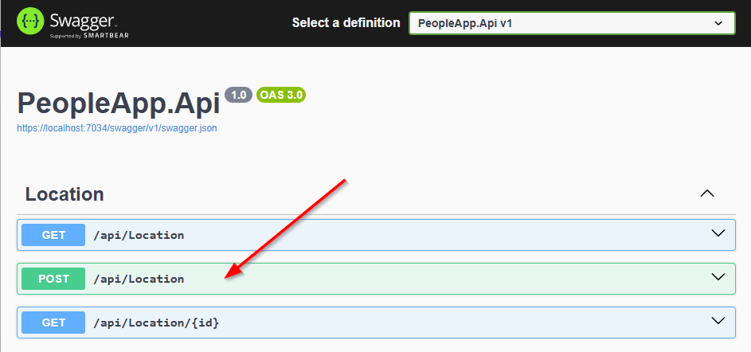

#### Postman
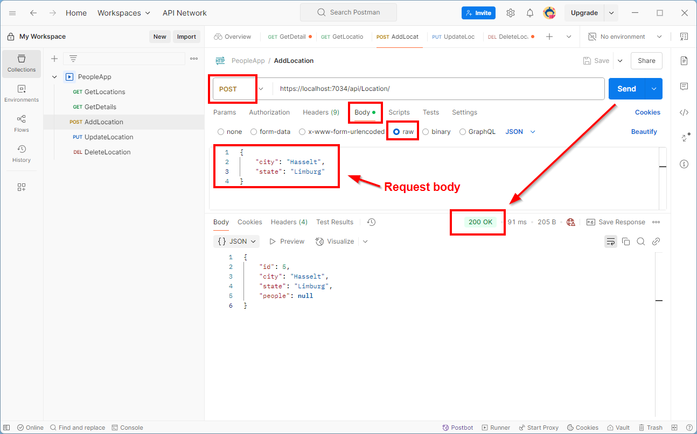

## UpdateLocation

```csharp
[HttpPut]
public async Task<ActionResult> UpdateLocation(Location model)
{
    try
    {
        _context.Locations.Update(model);
        int rows = await _context.SaveChangesAsync();
        if (rows == 0)
        {
            return NotFound();
        }
        return Ok();
    }
    catch (Exception)
    {
        return BadRequest();
    }
}
```

> [!CAUTION]
> Zorg ervoor dat de People-property van de Location entity **null** is, indien dit een lege lijst is (```new List<Person>()```) zal EF Core namelijk de bestaande records in de database 'updaten' (en dus schrappen aangezien de lijst leeg is).

> [!TIP]
> Indien er geen content in de response wordt verwacht kan je ook de NoContent methode gebruiken in plaats van de Ok methode. Dit zullen we toepassen in het volgende voorbeeld.

### Run!
#### Postman
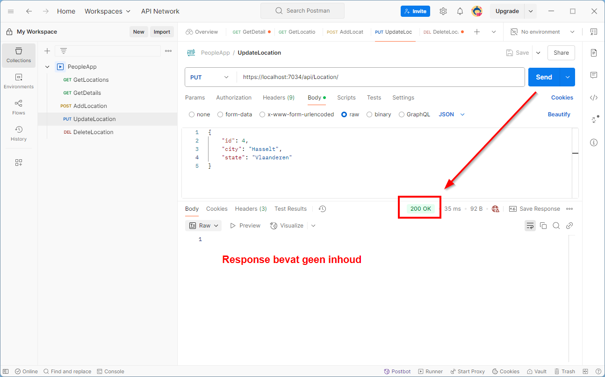

## DeleteLocation
```csharp
[HttpDelete("{id}")]
public async Task<ActionResult> DeleteLocation(long id)
{
    try
    {
        Location? location = await _context.Locations.FindAsync(id);
        if (location == null)
        {
            return NotFound();
        }
        _context.Locations.Remove(location);
        await _context.SaveChangesAsync();
        return NoContent();
    }
    catch (Exception)
    {
        return BadRequest();
    }
}
```
> [!TIP]
>   - Het [HttpDelete] attribuut (in combinatie met het [Route] attribuut van de controller) zorgt ervoor een HTTP DELETE request naar bv. “/api/location/1” wordt geleid. 
>   - Als de locatie niet gevonden wordt geven we het resultaat van de NotFound methode terug. Dit gaat zorgen voor een 404 code in de response.
>   - De NoContent methode zorgt ervoor dat de HTTP response een 204 code gaat hebben (met een lege body).

### Run!
- Maak ook voor de PUT en de DELETE request een postman-request aan

#### Swagger
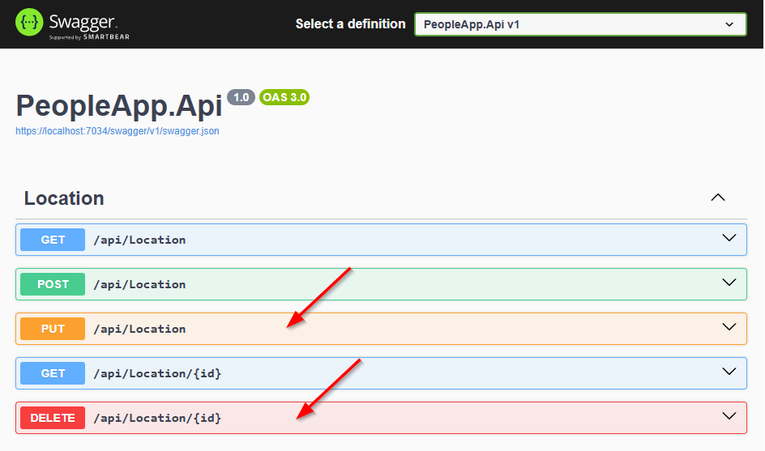

#### Postman
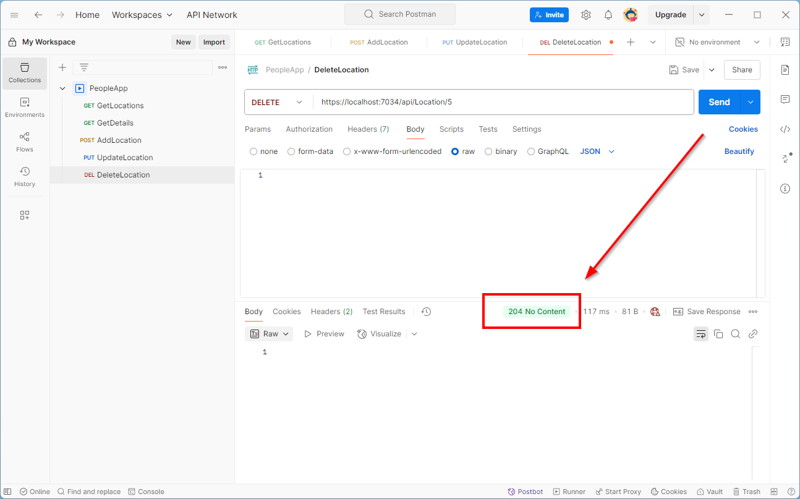
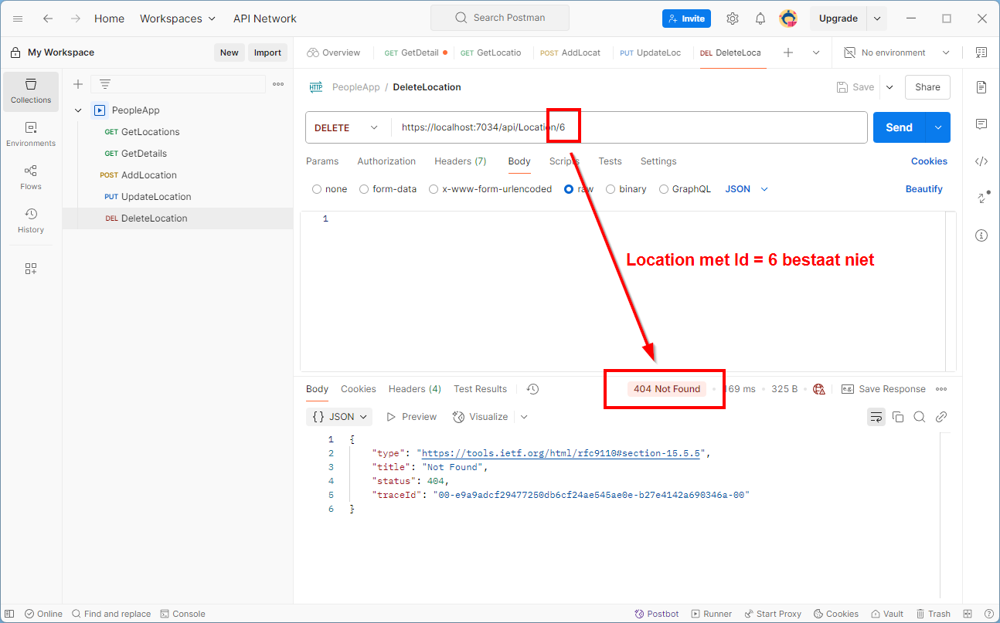

## Best practices

> [!IMPORTANT]  
> - **Gebruik bij voorkeur een repository- of een service-class om de database logica (dbContext) te encapsuleren.** Enkel voor demo doeleinden zoals dit labo wordt een dbContext rechtstreeks in een controller geïnjecteerd.
- Gebruik altijd asynchrone methodes/functies in een API, zeker bij het werken met databases en/of bestanden.
- Gebruik altijd de juiste HTTP status codes in je responses.
- Gebruik altijd de juiste HTTP verbs voor de juiste acties.

# Oefening
- Maak 2 nieuwe controllers aan voor de entities ```Department``` en ```Person```
- Voeg de nodige actions toe om deze entities te beheren